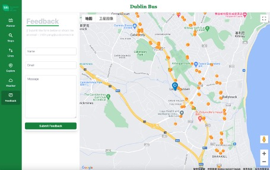

# Dublin Bus React-Django App

With Dubin Bus being the biggest provider of transportation around Ireland, bus time prediction is central to the perceived quality of service by its users. Therefore, this project report is focused on both using historical data to create models to improve predictability and secondly outlining how this project has succeeded in allowing the results for the model to be displayed in an accessible and understandable way through the use of a web application. Central to this, this project report also discusses the approach to collaboration, details on system architecture before discussing the testing and results of the project

Visit our Dublin Bus app [here](http://ec2-34-245-45-115.eu-west-1.compute.amazonaws.com:3000/).

## Features

### Journey Planner

The journey planner feature provides dynamic travel time estimates for the next seven days. 

### Stops Search

The stops search feature aims to provide real-time information about buses that will arrive at a selected stop within the next hour, including line names, arrival times, and delays. In addition to selecting stops through the combo box, users can also select stops by clicking the stop icon on the map.

### Lines Search

The lines search feature aims to provide stop names and stop sequences in a selected bus line. And also the selected line and the stops in it will be displayed on the map

### Explore Nearby

The explore nearby feature can provide information about restaurants, hotels, and attractions near the user's current location. The blue location icon represents the user's current location on the map. Users can filter and display them by star rating. The display on the map will change according to the user's operation, and the user can also select the restaurant or hotel, or attraction they want to view through the map.

### Weather Forecast

The weather forecast feature can provide weather information for today and the next four days 

### Feedback

The feedback feature allows users to give the operator  feedback on their experience of using this app and their suggestions for its improvement. After the user fills in the form and clicks submit, the authors will receive the corresponding feedback email as an alert and all the feedback is available on getform.io website.

### News about Dublin Bus

The news feature can provide news about Dublin Bus using google search and Twitter.

## Technologies

- React
- Django
- PostgreSQL
- Tailwind CSS
- Jupyter Notebooks
- AWS EC2

